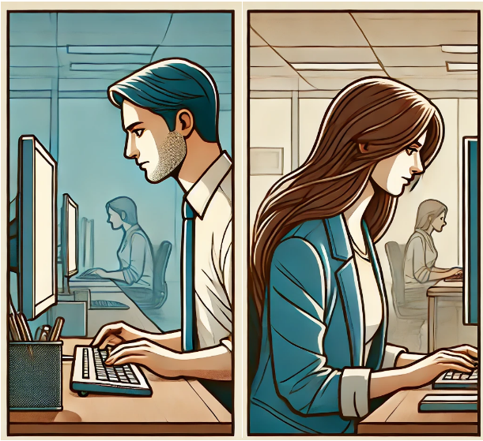
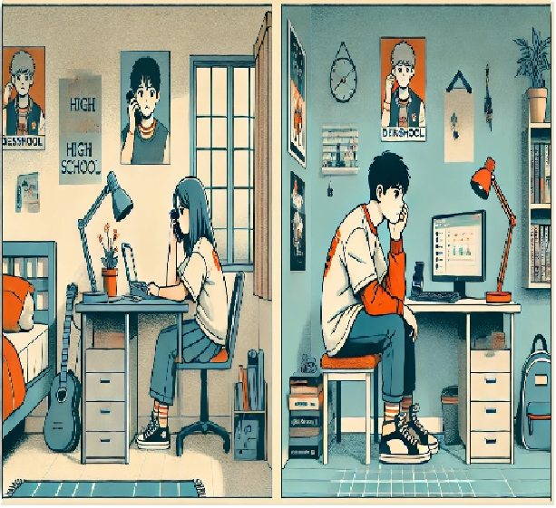

# 프로젝트 - MOMENT

## 1. 기획서

### 1. 프로젝트 소개

요즘 연인들은 영상통화를 통해 일상을 공유하고 재미있는 대화를 나누며 추억을 쌓습니다.   
하지만, 소중한 순간들이 통화가 종료되면 사라지는 것은 아쉽습니다.   
**MOMENT**는 연인들이 영상통화 중 나눈 재미있고 중요한 대화의 **하이라이트를 AI를 통해 클립으로 생성**하고, 커플의 일정 및 추억을 관리하는 앱입니다.

### 2. 목표

| 항목 | 내용 |
| --- | --- |
| 추억의 효과적인 저장 및 공유 | 영상통화 중의 소중한 순간들을 AI를 통해 하이라이트 클립으로 저장하고 쉽게 공유할 수 있게 합니다. |
| 연인 간의 소통 강화 | 대화의 하이라이트를 통해 서로의 일상과 감정을 더 깊이 이해하고 소통할 수 있게 합니다. |
| 일정 공유를 통한 계획 관리 | 커플 간의 일정 관리를 통해 중요한 약속을 놓치지 않고 더 나은 계획을 세울 수 있게 합니다. |
| 재미 요소 추가로 관계 유지 | 재미있는 클립과 추억을 통해 연인 간의 관계를 더욱 즐겁고 활기차게 유지할 수 있게 합니다. |

### 3. 타겟 / 페르소나
<table>
  <tr>
    <td colspan="2"></td>
    

    <td style="text-align: center; font-size: 22px;">20대 직장인 커플</td>
    

  </tr>
  <tr>
    <td style="text-align: center;">특징</td>
    <td style="text-align: center;">필요성</td>
    <td style="text-align: center;">사용 이유</td>
  </tr>
  <tr>
    <td> 서로 다른 회사에 다니며 바쁜 직장 생활로 인해 만나는 시간이 제한적입니다. </td>
    <td> 업무로 인한 스트레스를 덜고 함께한 소중한 시간을 간직하고 싶어합니다. </td>
    <td> 영상통화 하이라이트와 채팅 기능을 통해 바쁜 일상 속에서도 서로의 일상을 공유하고, 재미 요소를 추가하여 스트레스를 해소하며 관계를 유지할 수 있습니다. </td>
  </tr>
</table>

 

<table>
  <tr>
    <td colspan="2"></td>
    

    <td style="text-align: center; font-size: 22px;">장거리 연애 커플</td>
    

  </tr>
  <tr>
    <td style="text-align: center;">특징</td>
    <td style="text-align: center;">필요성</td>
    <td style="text-align: center;">사용 이유</td>
  </tr>
  <tr>
    <td> 서로 다른 지역 또는 국가에 거주하며, 주로 영상통화로 소통합니다. </td>
    <td> 물리적 거리가 멀어 자주 만날 수 없지만, 서로의 일상과 감정을 지속적으로 공유하고 싶어합니다. </td>
    <td> AI 분석 하이라이트 생성 서비스로 중요한 순간을 기록하여 다시 볼 수 있고, 교환 일기 기능을 통해 특별한 날을 기념하며, 일정 공유 기능으로 서로의 스케줄을 쉽게 파악할 수 있습니다.
 </td>
  </tr>
</table>

### 4. 제안 배경

**제안 배경 | 01 - 기존 커플 앱의 한계**

- 현재 시장에는 다양한 커플 앱이 존재하지만, 대부분의 앱은 단순한 채팅이나 일정 공유 기능에 그칩니다.
- 연인들이 더 풍부하고 다양한 방식으로 소통하고 추억을 저장할 수 있는 기능이 부족합니다. 특히, 영상통화와 같은 실시간 소통에서 중요한 순간을 기록하고 공유할 수 있는 기능이 필요합니다.

**제안 배경 | 02 - 추억의 중요성**

- 연인에게 있어서 소중한 순간들을 기록하고 공유하는 것은 관계를 더욱 돈독하게 만들어줍니다.
- 특별한 날의 사진이나 영상을 다시 꺼내보며 그때의 감정을 되새길 수 있는 기능은 연애 생활에 큰 가치를 더합니다.
- 교환일기와 같은 기능을 통해 특정 시점에 추억을 되돌아보는 것은 매우 감동적인 경험을 제공합니다.

**제안 배경 | 03 - 기존 영상 통화의 문제점**

- 따로 녹화하지 않는 이상 통화 내용을 저장할 수 없습니다.
- 녹화한 통화 내용에서 어느 부분이 흥미롭고 중요한지 바로 찾기 어렵습니다.

### 5. 기대효과

1. **추억의 효과적인 저장 및 공유**
    - 중요한 순간을 자동으로 하이라이트 클립으로 저장하여 언제든지 다시 감상할 수 있게 함으로써, 연인들이 소중한 추억을 영구적으로 보존할 수 있습니다.
2. **소통 강화**
    - 영상통화, 채팅, 일정 공유 기능 등을 통해 실시간으로 소통하고 서로의 일정을 파악함으로써 더 나은 관계를 유지할 수 있습니다.
3. **재미 요소 추가**
    - 함께 키우는 다마고치와 같은 재미 요소를 통해 앱 사용 자체를 즐겁게 만들고, 일상의 작은 즐거움을 더해 관계를 더욱 활기차게 유지할 수 있습니다.
4. **더 나은 계획 관리**
    - 일정 공유 기능을 통해 서로의 일정을 확인하고 계획을 세우는 것이 편리해져, 더 효율적으로 시간을 관리하고 함께하는 시간을 늘릴 수 있습니다.

## 2. 팀원 정보 및 업무 분담
- 프로젝트 기간 : 24.07.15 ~ 진행 중

| 이름 | 역할 | 내용 |
| --- | --- | --- |
| 조성빈 | -- | -- |
| 김예영 | -- | -- |
| 한지훈 | -- | -- |
| 김진우 | -- | -- |
| 박준영 | -- | -- |
| 조규범 | -- | -- |

## 3. 기능명세서

## 4. API 명세서

## 5. Info Architecture

## 6. ERD

## 7. 와이어프레임   

## 8. 페이지 별 기능 설명

## 9. 알고리즘 기술적 설명 (추천 알고리즘)

## 10. Project Gantt Chart

## 11. 느낀점 후기
| 이름 | 내용 |
| --- | --- |
| 조성빈 | -- |
| 김예영 | -- |
| 한지훈 | -- |
| 김진우 | -- |
| 박준영 | -- |
| 조규범 | -- |